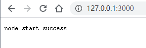
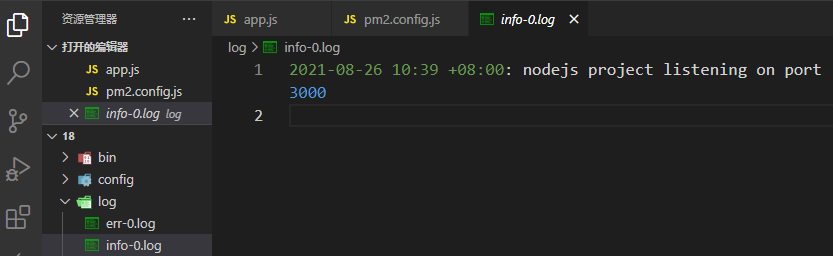

首先使用 [Koa](https://koa.bootcss.com/) 初始化一个`nodejs`项目

安装 Koa

```
npm install koa
```

根目录下新建 `app.js`

```javascript
// app.js
const Koa = require('koa')

const app = new Koa()

app.use(async (ctx) => {
  ctx.body = 'node start success'
})

app.listen(3000, () => {
  console.log(`nodejs project listening on port 3000`)
})

```

在项目所在目录打开命令行，运行启动命令

```javascript
node app.js
```



### 使用pm2

接下来使用  `pm2` 代替原始的 `node` 命令运行项目

[pm2官网](https://pm2.keymetrics.io/)

`pm2` 是`nodejs`进程管理器，使用 `npm`全局安装`pm2`

```javascript
npm install pm2 -g
```

创建一个配置文件，以更好管理`pm2`的启动，[官网地址](https://pm2.keymetrics.io/docs/usage/application-declaration/)  

**配置文件要以 .config.js 结尾**

```javascript
// pm2.config.js
module.exports = {
    apps : [{
      name: "nodejs-main-server-3000", // 启动进程名
      script: "./app.js", // 启动文件
      instances: 1, // 启动进程数
      exec_mode: 'cluster', // 多进程多实例
      env_development: {
        NODE_ENV: "development",
        watch: true, // 开发环境使用 true，其他必须设置为 false
        ignore_watch: ["log", "node_modules", "bin", "config"],
      },
      env_testing: {
        NODE_ENV: "testing",
        watch: false, // 开发环境使用 true，其他必须设置为 false
      },
      env_production: {
        NODE_ENV: "production",
        watch: false, // 开发环境使用 true，其他必须设置为 false
      },
      log_date_format: 'YYYY-MM-DD HH:mm:ss',
      error_file: './log/err.log', // 错误日志文件，必须设置在项目外的目录，这里为了测试
      out_file: './log/info.log', //  流水日志，包括 console.log 日志，必须设置在项目外的目录，这里为了测试
      max_restarts: 10,

    }
  ]
}
```

通过配置文件来启动，模式为开发模式。开发模式的`watch`为`true`，可以监听变化，自动重新编译

```javascript
pm2 start pm2.config.js --env development
```

启动后会在项目根目录下输出日志



修改`app.js`的内容，刷新页面，内容正常更新。说明项目启动和监听变动生效了