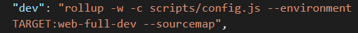
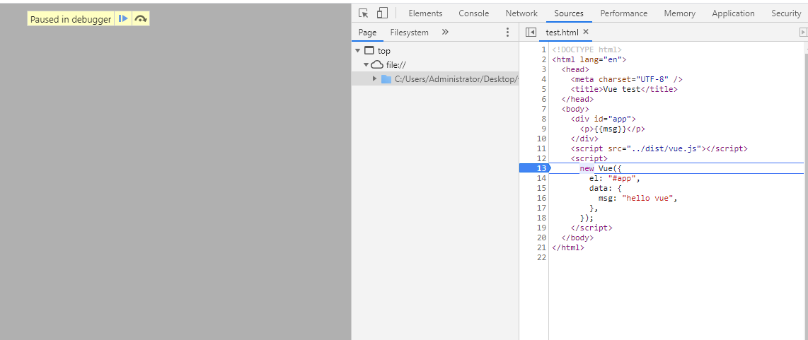

## Vue 的初始化 new Vue(options) 都做了什么

- 准备工作

  下载[vue 源码](https://github.com/vuejs/vue.git)到本地，在script的dev中，添加`--sourcemap`，然后运行`npm run dev`

  
  
  在 example 目录下新建一个 html 文件，作为入口文件用来调试。
  
  ```html
  <!DOCTYPE html>
  <html lang="en">
    <head>
      <meta charset="UTF-8" />
      <title>Vue test</title>
    </head>
    <body>
      <div id="app">
        <p>{{msg}}</p>
      </div>
      <script src="../dist/vue.js"></script>
      <script>
        new Vue({
          el: "#app",
          data: {
            msg: "hello vue",
          },
        });
      </script>
    </body>
  </html>
  
  ```
  
  在浏览器中打开这个html，打个断点就可以开始调试了
  
  

> ### Vue
>
> /src/core/instance/index.js

由 vue 的使用方式 new Vue 可知，Vue是一个构造函数。构造函数定义在`/src/core/instance/index.js`中。

```javascript
function Vue (options) {
  ...省略部分代码
  this._init(options)
}
initMixin(Vue)
```


> ### _init
>
> /src/core/instance/init.js

Vue构造函数中调动了_init方法，这个方法定义是挂载在原型链上的函数。定义在 `init.js`中的`initMixin`里

```javascript
export function initMixin(Vue: Class<Component>) {
  Vue.prototype._init = function (options?: Object) {
    //赋值，所以后续的 vm 就等价于 this
    const vm: Component = this;
    // a uid 
    vm._uid = uid++;

    // a flag to avoid this being observed
    vm._isVue = true;
    // merge options
    if (options && options._isComponent) {
      // optimize internal component instantiation
      // since dynamic options merging is pretty slow, and none of the
      // internal component options needs special treatment.
      initInternalComponent(vm, options);
    } else {
      // 初始化根组件时走到这里
      vm.$options = mergeOptions(
        resolveConstructorOptions(vm.constructor),
        options || {},
        vm
      );
    }
    /* istanbul ignore else */
    if (process.env.NODE_ENV !== "production") {
      initProxy(vm);
    } else {
      vm._renderProxy = vm;
    }
    // expose real self
    vm._self = vm;
    initLifecycle(vm);
    initEvents(vm);
    initRender(vm);
    callHook(vm, "beforeCreate");
    initInjections(vm); // resolve injections before data/props
    initState(vm);
    initProvide(vm); // resolve provide after data/props
    callHook(vm, "created");

    if (vm.$options.el) {
      vm.$mount(vm.$options.el);
    }
  };
}
```


> ### resolveConstructorOptions
>
> /src/core/instance/init.js

```javascript
/**
* 入参是 vm.constructor，也就是 function Vue 这个构造函数
*/
export function resolveConstructorOptions(Ctor: Class<Component>) {
  let options = Ctor.options;
  if (Ctor.super) {
    const superOptions = resolveConstructorOptions(Ctor.super);
    const cachedSuperOptions = Ctor.superOptions;
    if (superOptions !== cachedSuperOptions) {
      // super option changed,
      // need to resolve new options.
      Ctor.superOptions = superOptions;
      // check if there are any late-modified/attached options (#4976)
      const modifiedOptions = resolveModifiedOptions(Ctor);
      // update base extend options
      if (modifiedOptions) {
        extend(Ctor.extendOptions, modifiedOptions);
      }
      options = Ctor.options = mergeOptions(superOptions, Ctor.extendOptions);
      if (options.name) {
        options.components[options.name] = Ctor;
      }
    }
  }
  return options;
}
```


> ### mergeOptions
>
> /src/core/util/options.js

```javascript
/**
 * 合并两个 options 对象
 */
export function mergeOptions (
  parent: Object,
  child: Object,
  vm?: Component
): Object {
  if (process.env.NODE_ENV !== 'production') {
    // 如果child 的 options 里有 components的话，
    // 验证 components 的名字是否合法
    checkComponents(child)
  }

  if (typeof child === 'function') {
    child = child.options
  }
  // 对 props 格式规范化，例如 'a-b:String' 会变成 'aB:{type: String}'
  // 所以 props 书写的时候‘-’或驼峰都行，用的时候只能驼峰
  normalizeProps(child, vm)
  normalizeInject(child, vm)
  normalizeDirectives(child)

  // Apply extends and mixins on the child options,
  // but only if it is a raw options object that isn't
  // the result of another mergeOptions call.
  // Only merged options has the _base property.
   
  // 合并过的options，会有_base属性，就不再进行合并
  if (!child._base) {
    if (child.extends) {
      parent = mergeOptions(parent, child.extends, vm)
    }
    if (child.mixins) {
      for (let i = 0, l = child.mixins.length; i < l; i++) {
        parent = mergeOptions(parent, child.mixins[i], vm)
      }
    }
  }

  const options = {}
  let key
  // 下面两个for是为了合并 parent 和 child
  for (key in parent) {
    mergeField(key)
  }
  for (key in child) {
    // child 中和 parent 重名的key选项，已经在上一个parent循环中合并过了，
    // 所以再这里跳过
    if (!hasOwn(parent, key)) {
      mergeField(key)
    }
  }
  // 合并 parent[key] 和 child[key], child[key]优先级高
  function mergeField (key) {
    const strat = strats[key] || defaultStrat
    options[key] = strat(parent[key], child[key], vm, key)
  }
  return options
}
```

